1. 简介
==========

本章简要地说明HiHome透明装饰使用手册（以下简称本手册）的目的和范围。

1.1手册目的
--------------

&#8194;&#8194;&#8194;&#8194;本手册目的在于告诉HiHome透明装饰PC端后台管理、PC端官网、透明装饰APP的使用者，透明装饰提供了哪些功能，以及如何正确地、有效地来使用这些功能。

1.2手册范围
----------

&#8194;&#8194;&#8194;&#8194;本手册首先简要地介绍透明装饰结构以及软件环境，然后说明官网、后台管理、移动端APP为使用者提供的各项功能及其详细的操作步骤。
本手册各章节内容安排如下： 
 
第一章  简    介: 简单说明透明装饰的内容。  
第二章  系统概述: 简单说明透明装饰的结构及其执行环境。  
第三章  功能模块：详细说明各个系统的功能模块。  
其中“第三章 功能模块”为本手册之重点，希望阅读本手册者能深入了解。

#2. 透明装饰简述#
&#8194;&#8194;&#8194;&#8194;HiHome透明装饰是专门为装饰公司提供的， 管理员作为公司管理身份登录后台管理系统可以进行任何权限范围内的操作，比如编辑所在的装饰公司的信息展现给用户、创建项目、浏览机构下的人员配置以及项目分布等。 
 
透明装饰系统包括前端官网、后台管理、移动APP端。 
 
官网主要包括首页、产品、下载、案例、合作、管理后台入口以及免费注册： 
1. 首页：该页面包括轮播图片展示，应用下载快捷入口、后台管理快捷入口； 
2. 产品：该模块介绍透明装饰产品信息。 
3. 下载：该模块提供移动端APP下载以及后台管理快捷入口。 
4. 案例：该模块提供透明装饰系统实际使用案例。 
5. 合作：该模块提供业务合作、合作伙伴、广告服务、联系我们、关于我们等信息。 
 
后台管理主要包括以下3大模块： 
1. 公司信息：该模块包括：公司信息、机构配置、用户配置、配置验收评价题库以及配置流程模板； 
2. 项目管理：该模块包括：项目创建和项目列表；  
3. 统计报表：该模块包括：机构项目人员概况报表、人员项目概况报表和机构人员概况报表； 
移动APP端分为Android端和iOS端。 
 
硬件运行环境： 
1. 适用机型： 可以运行http://tmzsgl.hihome.cn/admin/main.html网址的计算机。 
 
软件运行环境： 
1. 浏览器：版本不要过低，市场上比较常见的几款浏览器均已适配，比如谷歌、360、Safari等。  
2. 编程语言：HTML5、CSS、JS等； 
>官网地址：http://tmzs.hihome.cn/website/home,可点击前往**[官网](http://tmzs.hihome.cn/website/home)**
>
>后台管理地址：http://tmzsgl.hihome.cn/admin/login.html,可点击前往**[后台管理](http://tmzsgl.hihome.cn/admin/login.html)**

#3.功能模块#

##3.1 官网介绍##

###3.1.1 功能介绍###

####3.1.1.1 首页####

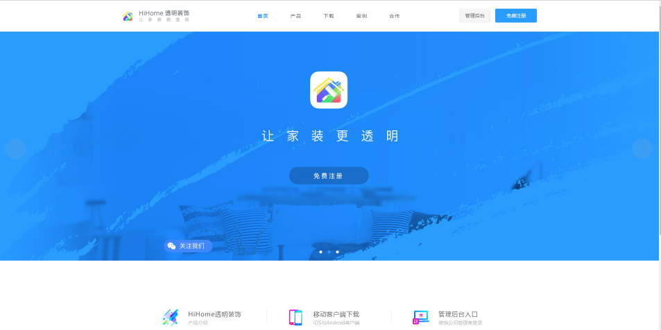
 
 
该页面提供透明装饰轮播展示图片。提供HiHome透明装饰产品介绍快捷入口。 
点击产品介绍：
 
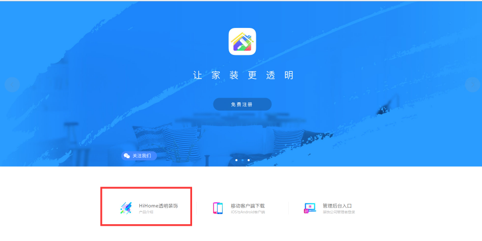
进入产品介绍页面。 
点击移动客户端下载 
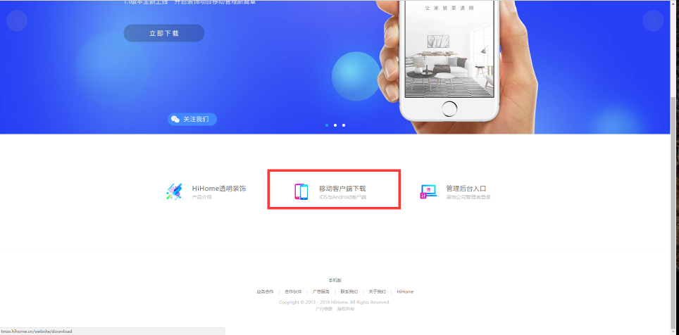
进入产品下载页面。 
点击管理后台入口: 
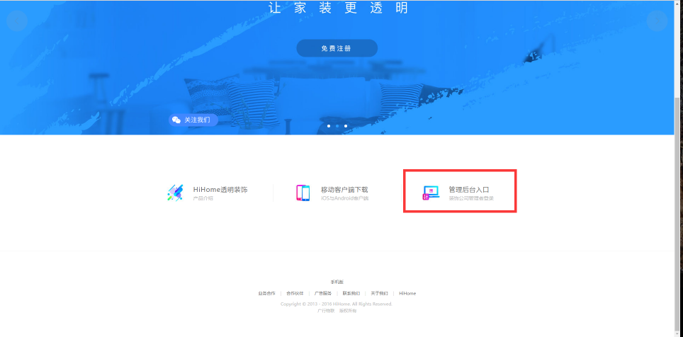
进入透明装饰管理后台。

####3.1.1.2 产品####
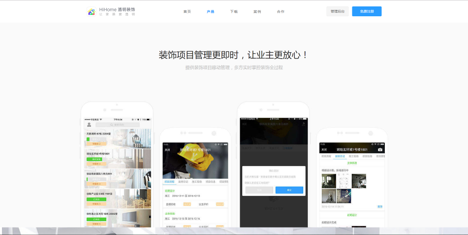
该页面详细介绍了透明装饰管理提供的功能。

####3.1.1.3 下载####

下载页面提供了iPhone版本、Android版本下载。以及提供了管理后台的快捷入口。 
点击下载按钮: 
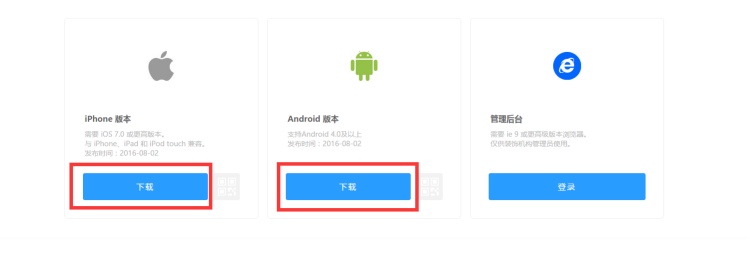 
iPhone版本进入apple store下载。 
Android版本进入下载页面，点击即可下载。 
下载也支持扫码下载，鼠标放到对应版本的二维码上 
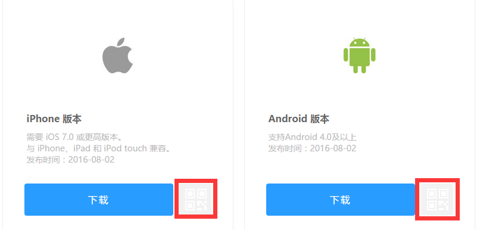 
即可出现对应的下载二维码：
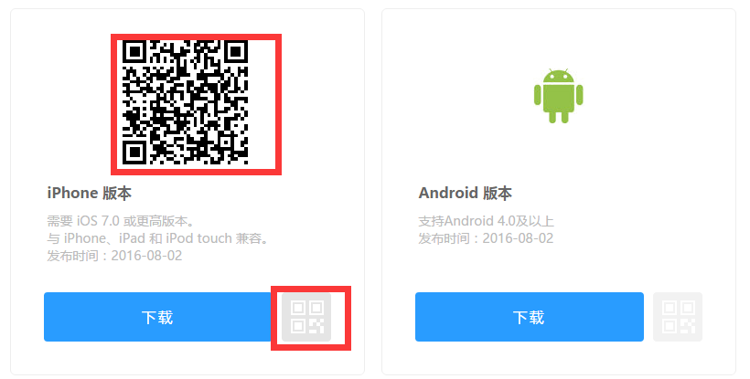 
扫码即可下载。

####3.1.1.4 案例####
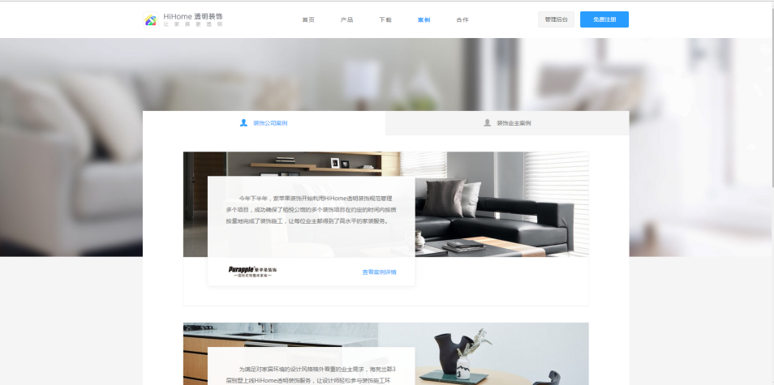 
案例展示页面提供了装修公司案例以及业主案例，点击案例详情即可查看详细案例展示信息。

####3.1.1.5 合作####
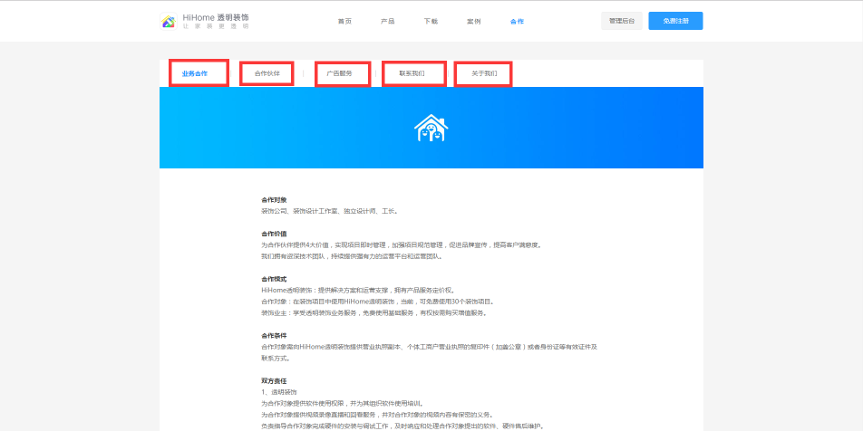 
合作页面，提供业务合作信息、合作伙伴信息、广告服务信息等信息展示。点击对应按钮即可查询。 
联系我们页面提供了联系方式，如果您有任何问题需要咨询，可以通过多种方式与我们联系。

####3.1.1.6 注册####
任意页面点击免费注册按钮
 
进入注册页面
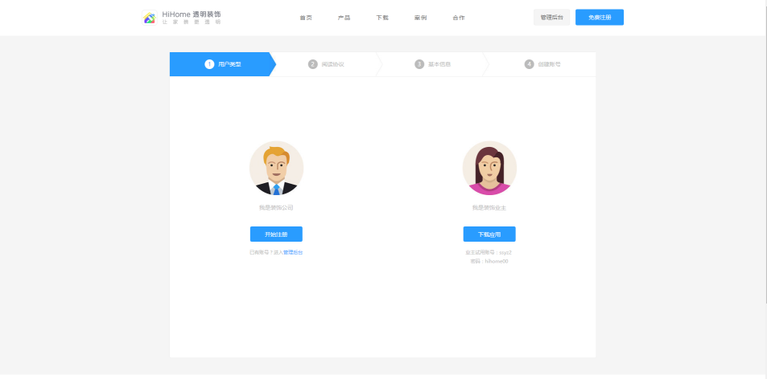 
注册页面下，根据您的角色，按照提示即可成功注册。

##3.2 管理后台介绍##

###3.2.1 系统管理###
**温馨提示**： 
创建项目之前必须要进行的操作： 
> 机构配置 
 用户配置 
 配置验收题库 
 配置流程模板 

目的是创建项目以选择使用。 

####3.2.1.1 公司信息####
登录装饰公司已有的账号密码，进入透明装饰页面，点击系统管理下的公司信息，如图： 
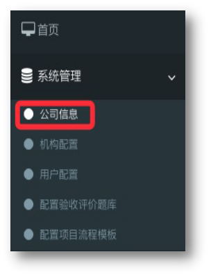 
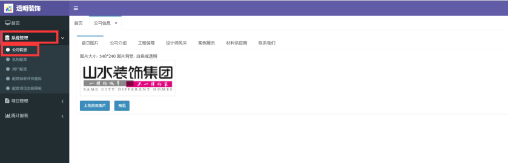 
进入公司信息配置模块，公司信息配置分为首页图片、公司介绍、工程保障、设计师风采、案例展示、材料供应商以及联系我们七个小模块。

#####3.2.1.1.1首页图片####

首页图片配置完成后，在移动APP中品牌模块中显示。
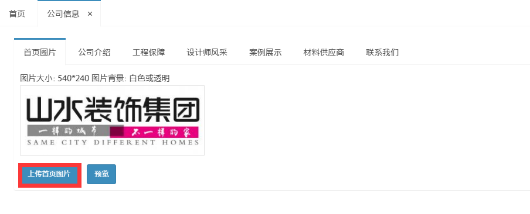 
点击上传首页图片，选择需要配置的图片。 
上传完成点击预览可以查看上传图片在移动端的显示样式。 
 
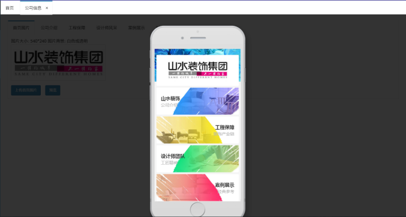 
若上传图片错误或者显示出现问题，重新操作上传新的图片即可。

#####3.2.1.1.2公司介绍#####

点击公司介绍，进行公司介绍信息配置。 

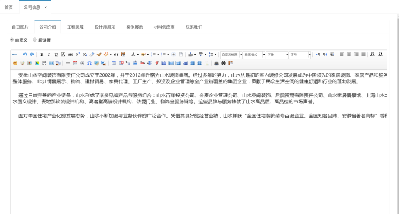 

公司介绍配置有两个方式。 

方式一：选择自定义模式，在文本编辑器中录入需要显示的公司介绍信息 
 
文本编辑器提供文本样式的编辑，允许添加图片、表格等多媒体文件。
完成编辑后点击保存即可。

方式二：
若装饰公司有自己的官网公司介绍，可以直接选择超链接模式。 
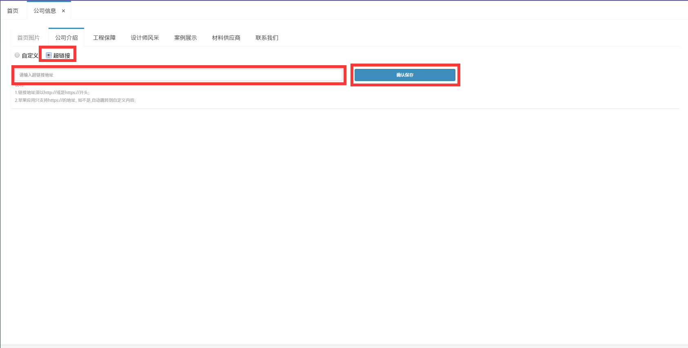 

在文本框中录入网址，点击保存。

#####3.2.1.1.3工程保障#####

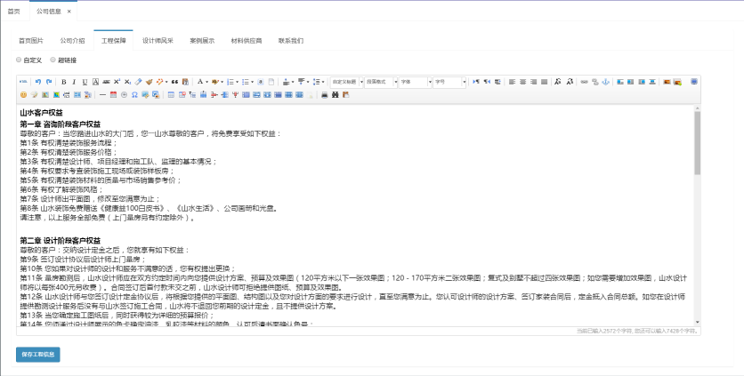 

与公司介绍编辑模式相同，提供两种方式。参照公司介绍的操作方式。

#####3.2.1.1.4设计师风采#####

 

与公司介绍编辑模式相同，提供两种方式。参照公司介绍的操作方式。

#####3.2.1.1.5案例展示#####

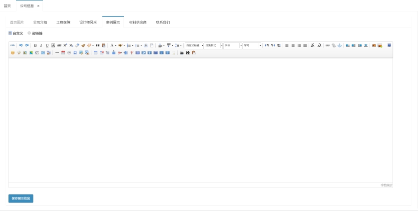 

与公司介绍编辑模式相同，提供两种方式。参照公司介绍的操作方式。

#####3.2.1.1.6材料供应商#####

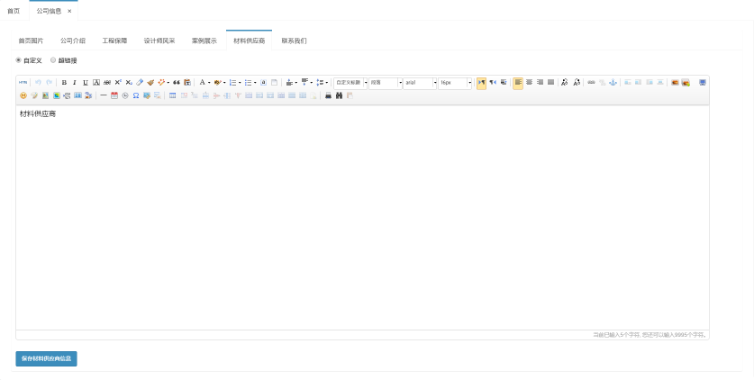 

与公司介绍编辑模式相同，提供两种方式。参照公司介绍的操作方式。

#####3.2.1.1.7联系我们#####

 

与公司介绍编辑模式相同，提供两种方式。参照公司介绍的操作方式。

####3.2.1.2 机构配置####

点击系统管理中的机构配置，如图： 

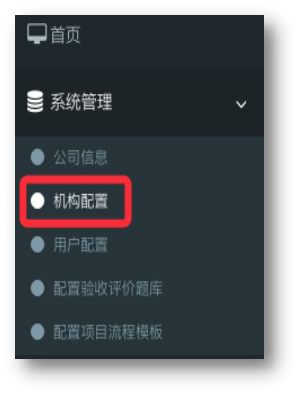 
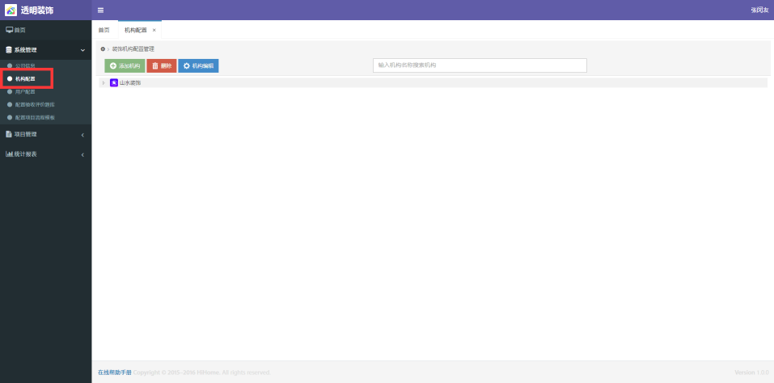 

进入机构配置页面。提供添加子机构、删除机构、机构编辑等功能。

#####3.2.1.2.1 添加机构#####

选中需要添加子机构的机构名称，点击添加机构按钮。

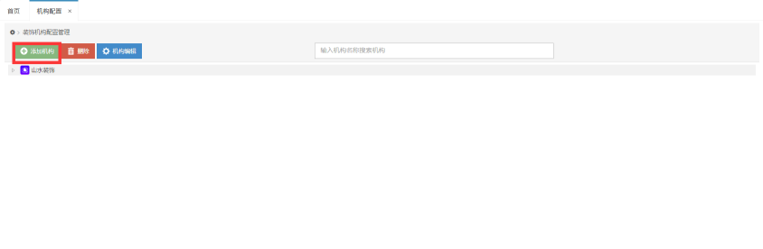 

弹出添加对话框： 

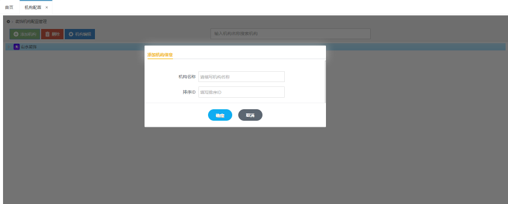 

录入需要添加的子机构名称，排序ID（显示顺序，可以自行定义） 

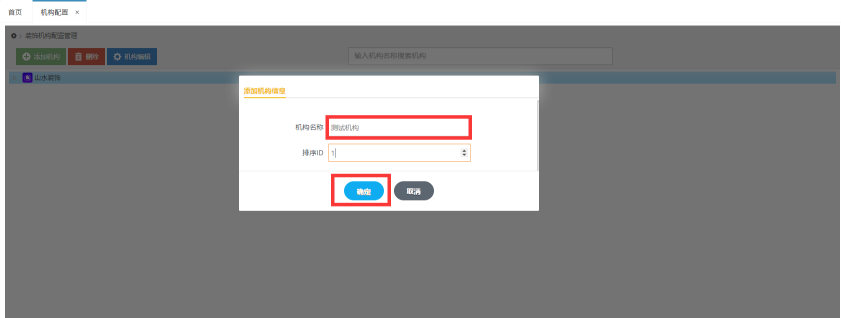 

点击保存。 

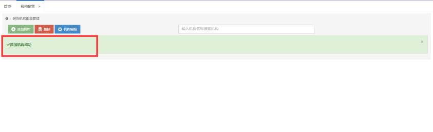 
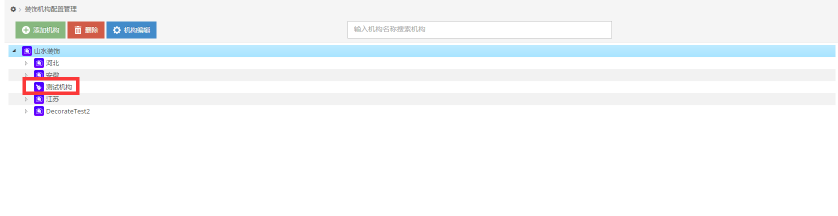 
添加成功。

#####3.2.1.2.2 删除机构#####

点击需要删除的机构 
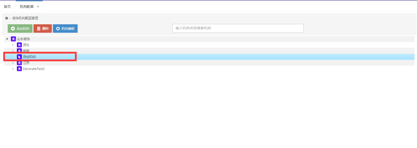 

点击删除按钮： 

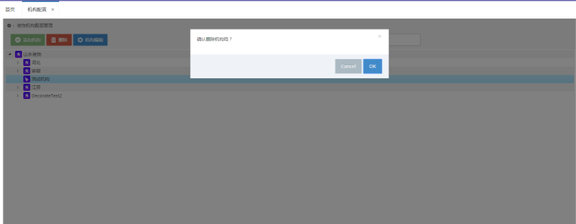 

在弹出的对话框中，点击确认。即可删除机构。 

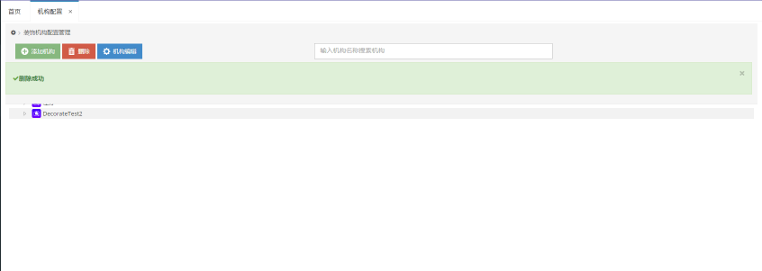 

#####3.2.1.2.3 机构编辑#####

选中需要编辑的机构，点击机构编辑按钮。弹出编辑对话框： 
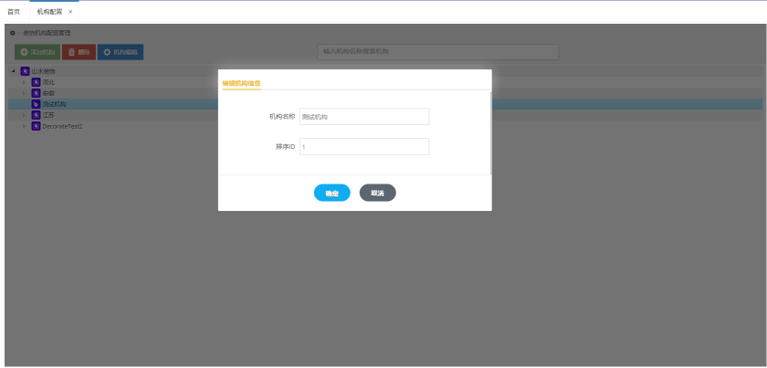 
对话框中可以编辑机构名称与排序ID。编辑后点击确认即可。

####3.2.1.3 用户配置####
点击系统管理中的用户配置，如下： 
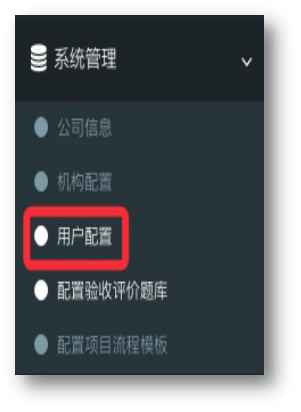 
 

点击进入用户配置模块。 
选中需要添加用户的机构后，有两种方式添加用户：

#####3.2.1.3.1添加用户#####

添加用户分为两种模式：

######3.2.1.3.1.1单一添加用户######

选中需要添加用户的机构，点击列表下方按钮。弹出添加用户对话框： 
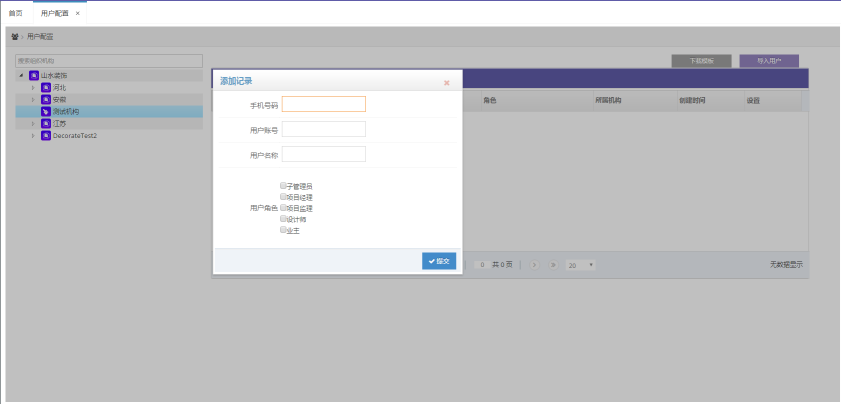 

录入用户信息，选择用户角色。点击提交即可。

######3.2.1.3.1.2 批量添加用户######

系统提供批量导入数据功能，先下载模板。 
点击用户列表右上角，下载模板按钮。下载数据模板。 
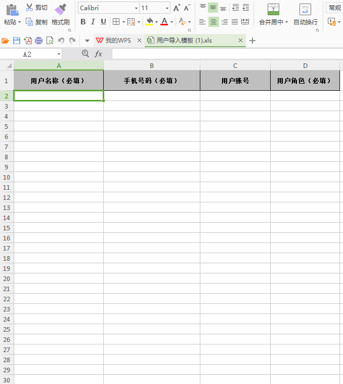 
 
按模板的格式录入人员信息。
录入完成后，点击用户列表右上角导入用户按钮 

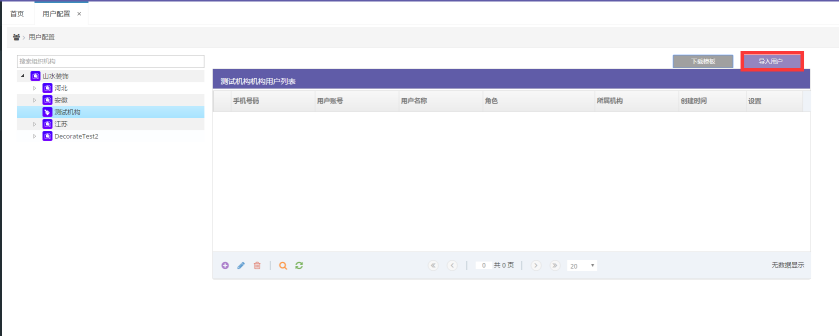 

选择编辑好的数据文档。提交后等待录入完成即可。

#####3.2.1.3.2删除用户#####
选中需要删除的用户，点击按钮，弹出对话框： 

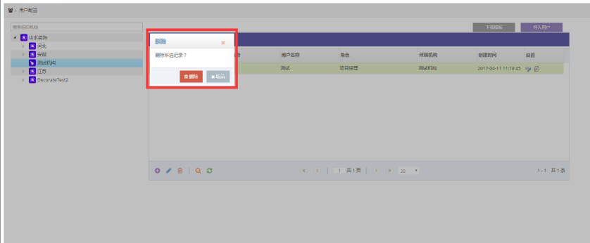 

点击删除按钮，即可删除用户。

#####3.2.1.3.3 编辑用户#####

选中需要编辑的用户，点击按钮。弹出编辑对话框： 

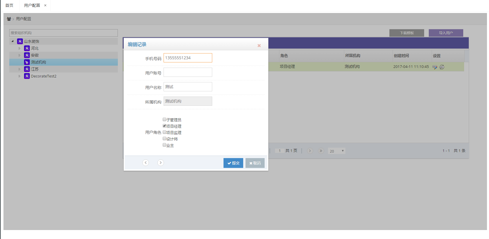 

可以修改用户手机号、用户账户、用户名称以及角色信息。编辑完成点击提交即可。

#####3.2.1.3.4 搜索用户#####

点击按钮，弹出搜索对话框： 

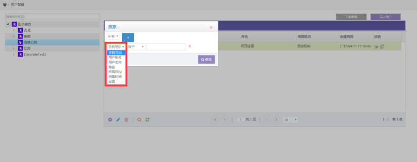 

可以根据用户名称、手机号、账号、机构等进行搜索。

####3.2.1.4 配置验收评价题库####

点击系统管理中的配置流程模板，如下： 

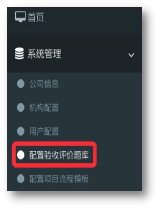 

进入以下页面： 

 

**注释：** 
>1. 除系统题库外，可对题库进行添加、重命名、删除操作。
2. 除系统题目外，可对验收题目或评价题目进行添加、删除、刷新操作，题目类型分为判断和选择，属性分为自定义题目和系统自带题目。

####3.2.1.5 配置项目流程模板####

点击系统管理中的“配置流程模板”（如图）： 

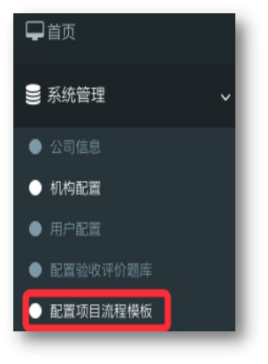 

进入以下界面： 

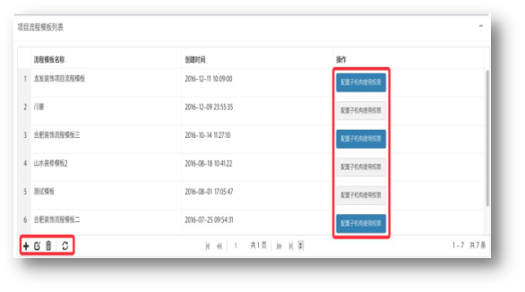 

上图中最下方的红色框内是对项目流程模板进行增加、编辑、删除、刷新按钮，已添加的模板后边可配置子机构的使用权限，若不配置，系统会默认子机构无法使用。 

**为流程模板添加流程阶段** 

添加一个流程模板，下方对应的流程模板详情板块会显示其内的每个流程阶段，在项目流程模板详情中，可以对具体的流程阶段进行添加、编辑、删除、刷新操作（如图中下方的红色方框） 

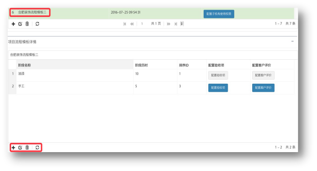 

**为流程阶段配置验收项和客户评价** 
1. 打开任一项目流程模板的“项目流程模板详情”，点击每个阶段后对应的“配置验收项”和“配置客户评价”（如图）： 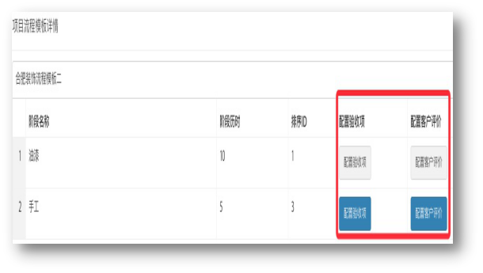 
2. 弹出验收项，然后选择，之后保存即可（如下图）。配置验收项或客户评价的目的便于监理或业主根据国家装修标准评判装修是否合格。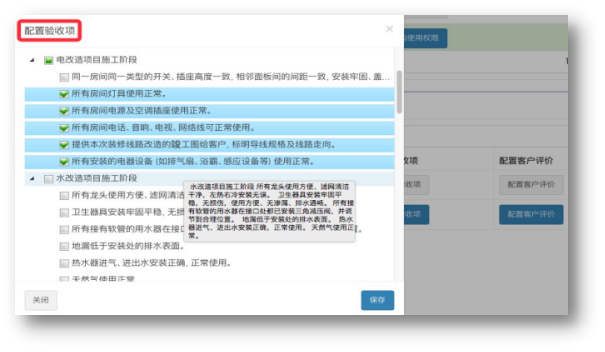

####3.2.1.4配置验收评价题库####

点击进入配置验收评价题库模块 
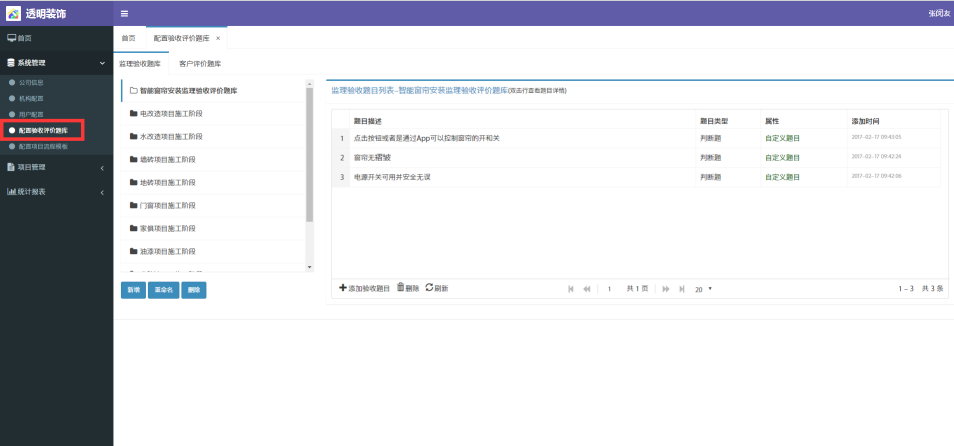 
系统默认提供一定量的默认题库。用户可根据自己的需求添加。

#####3.2.1.4.1配置验收项题库#####

######3.2.1.4.1.1验收库配置######

**1） 新增验收库** 
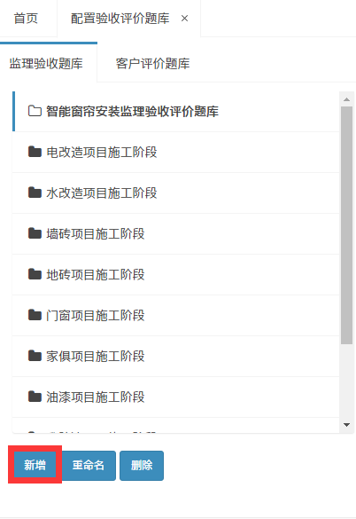 

点击新增按钮，弹出新增对话框： 

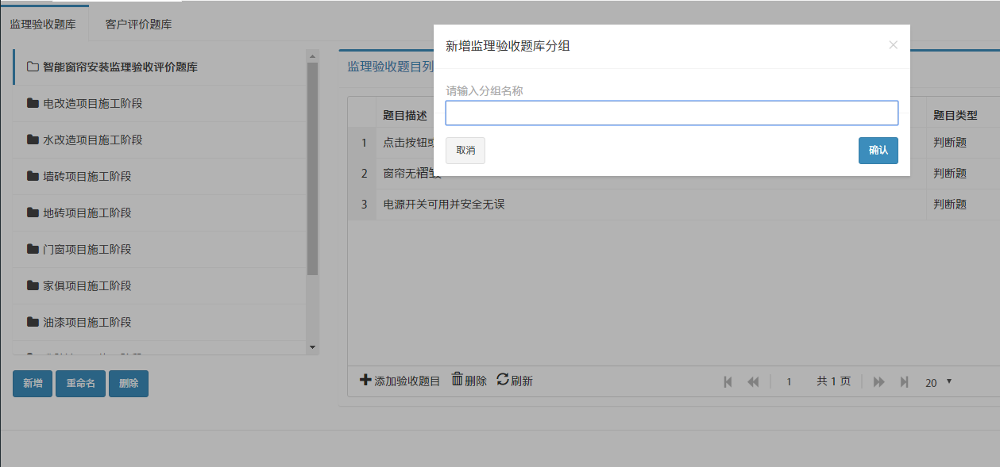 

录入新增题目分组名称，点击确认添加。 

**2) 重命名验收库** 

点击选中需要重命名的题库分组（系统提供的默认题库不支持重命名），弹出编辑对话框 

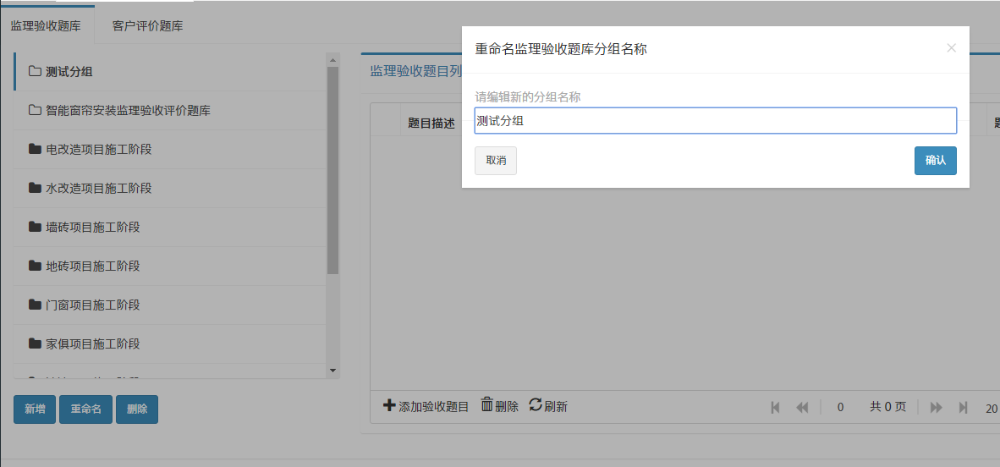 

编辑名称点击确认保存。 

**3) 删除验收库** 

点击选中需要删除的题库分组（系统提供的默认题库不支持删除），弹出删除对话框 

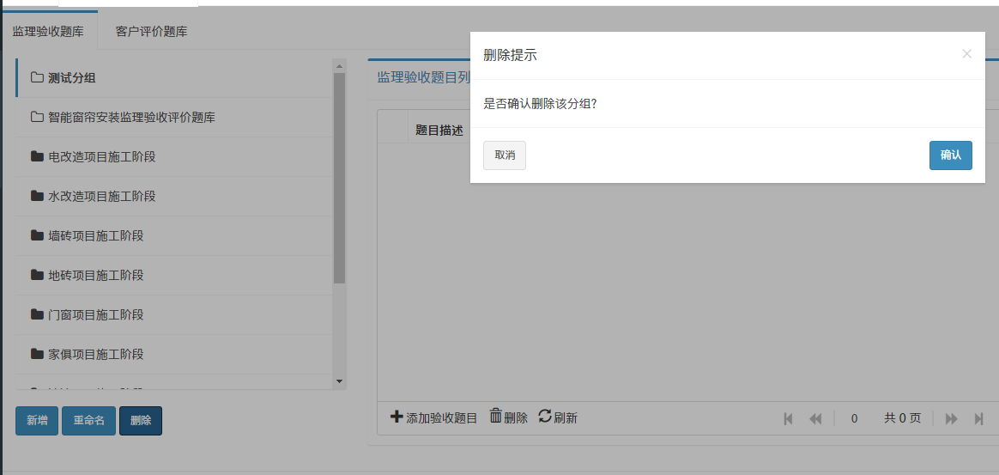 

点击确认，即可删除。

######3.2.1.4.1.2验收项配置######

**1) 新增验收项** 

选中需要添加题目的分组，点击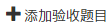按钮，弹出添加对话框 

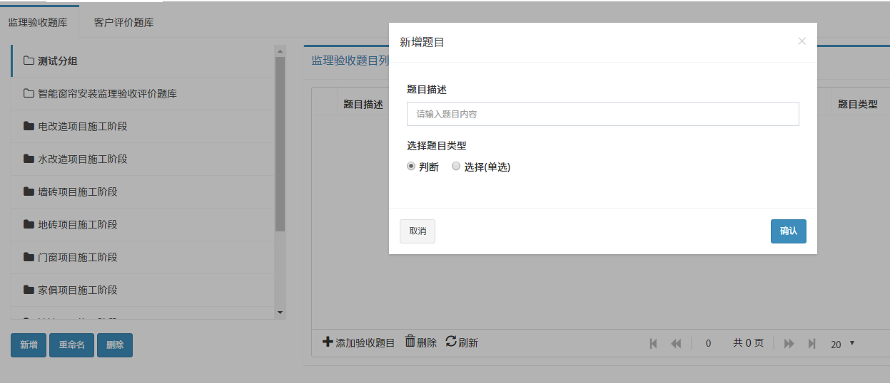 

录入题目，选择题目类型。选中选择类型，需录入选项的数据。 

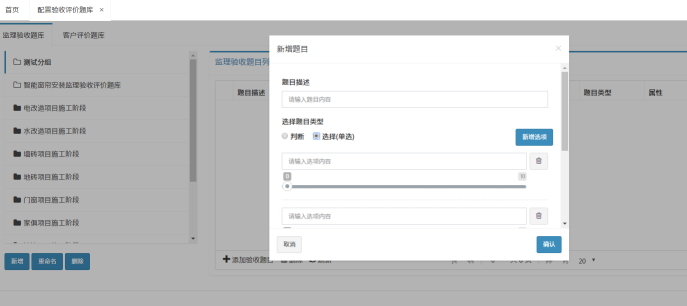 

录入完成后，点击确认，即可添加成功。 

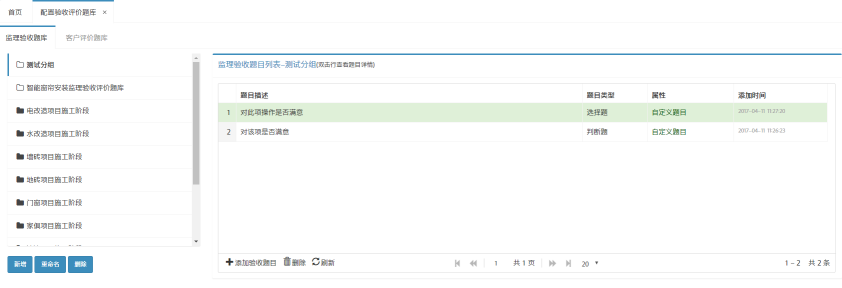 

双击验收项题目，可查看详情： 

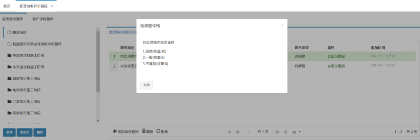 

**2) 删除验收项** 

选择需要删除的验收项，点击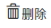按钮，弹出删除对话框: 

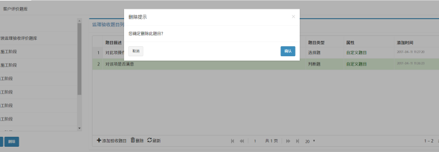 

点击确认即可删除。 

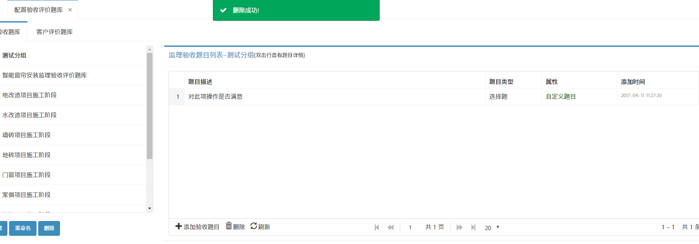 

#####3.2.1.4.2配置客户评价题库#####